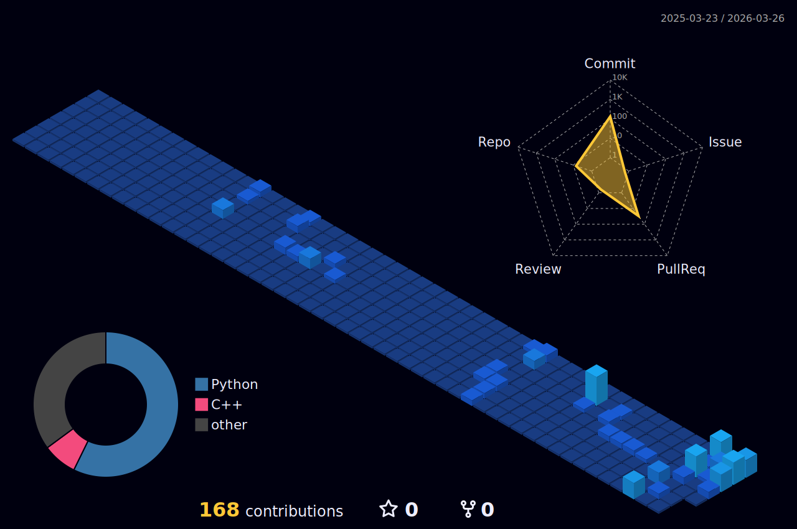

<h2 align="center">likell1</h2>

  Data Engineering · Distributed Systems · MLOps

  Spark · Kafka · Docker · Kubernetes

---

## 👨‍💻 About
I am studying data engineering with a focus on building reliable and scalable data pipelines.

My interests include the full lifecycle of data systems — ingestion, processing, storage, and automation — as well as operating data workloads in distributed and containerized environments.

I am particularly interested in:
- Designing robust batch and streaming pipelines
- Understanding system reliability and failure handling
- Building reproducible and maintainable data and ML workflows

---

## 🛠 Tech Stack

### Operating Systems

### Languages

### Data & Infrastructure

### ML / MLOps

---

## 🚀 Engineering Focus
- Reliability and fault tolerance in ETL/ELT data pipelines
- Latency and consistency trade-offs in streaming systems
- Containerized execution and deployment environments
- Experiment tracking and reproducibility for ML workflows

---

## 📊 GitHub Stats

  
  

---

## 📫 Contact
- Email: **eru010930@gmail.com**

---

  

## 🧊 3D Contribution Graph

